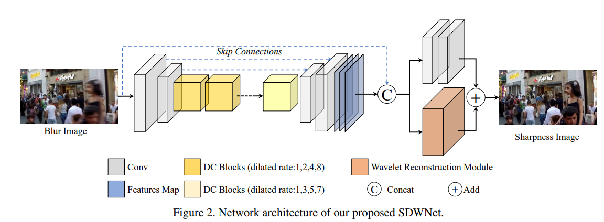

# SDWNet: A Straight Dilated Network with Wavelet Transformation for Image Deblurring(offical)


# 1. Introduction
This repo is not only used for our paper(SDWNet) but also used for Deblur codebase. We implement a number of components that allow you to quickly implement your own model.

- **Paper**
  The SDWNet has been accepted by **iccvw2021**, you can read the [paper](https://arxiv.org/abs/2110.05803) here.
- **Model**
  


# 2. Folder Structure
```
  ---SDWNet
  |
  |- config
  |    |- model.yaml                            -> Model all traninig hyparameters with data log.
  |    |-Config.py                              -> Translate the config file to dict.
  |- data
  |    |- vanilar_dataset.py                    -> The dataset for build the LR & HR images.
  |    |- utils.py                              -> Utils for get patch and calculate the model metrics.
  |    |- augments.py                           -> Augment method for LR & HR images.
  |- model
  |    - NTIRE2021_Deblur
  |        - uniA_ELU
  |            |- layerlib_stage1               -> Model module.
  |            |- model_stage1_dual_branch_tail.py -> Main model.
  |- loss
  |   |- gendrator_loss.py                      -> Loss function define.
  |- optim
  |   |- optimizer.py                           -> Optimizer function define.
  |- train.py                                   -> Training.
  |- goprol_train.sh                             -> Training shell.
  |- inference_ddp.py                           -> Inference.
  |- inference_ddp.sh                           -> Inference shell.

```
# 3. Training
- Crop the src Training LR and HR images to 480x480 by sliding window which step is 240, so we got 24 patchs form one 720x1280 images both LR and HR.
- Training the model with the 416 x 416 size, use randomcrop, RGB shuffle, horizon flip, rotate and so on.
- Normalize the images to Tensor with 255 but not 1. which without process the mean and std.
```bash
python -W ignore train.py \
--config_file $config_folder \
--dist-url 'tcp://127.0.0.1:8888' \
--dist-backend 'nccl' \
--multiprocessing-distributed=1 \
--world-size=1 \
--rank=0 \
```
# 4. Inference
- Inference the src LR images and get the SR images
```bash
python -W ignore inference_ddp.py \
--config_file $config_folder \
--dist-url 'tcp://127.0.0.1:8989' \
--dist-backend 'nccl' \
--multiprocessing-distributed=1 \
--world-size=1 \
--rank=0 \
```

# 5. Calculate
- Calculate the PSNR and SSIM
```
python utils/calc_psnr_ssim_official.py
```

If you find this repo useful for your research, please consider citing the papers
```
@InProceedings{
  Zou_2021_ICCV, 
  author = {Zou, Wenbin and Jiang, Mingchao and Zhang, Yunchen and Chen, Liang and Lu, Zhiyong and Wu, Yi}, 
  title = {SDWNet: A Straight Dilated Network With Wavelet Transformation for Image Deblurring}, 
  booktitle = {Proceedings of the IEEE/CVF International Conference on Computer Vision (ICCV) Workshops}, 
  month = {October}, 
  year = {2021}, 
  pages = {1895-1904} 
  }
```